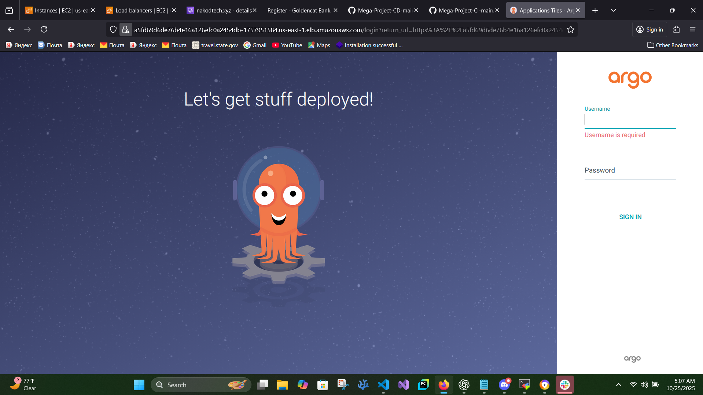

# 🔐 Default Argo CD Login Credentials

When you access the Argo CD UI 🐙 for the first time, you’ll need the default admin credentials to log in.

---

## 🧾 Default Login Details

| Field           | Value                         |
| --------------- | ----------------------------- |
| 👤 **Username** | `admin`                       |
| 🔑 **Password** | Stored in a Kubernetes Secret |

---

## 🧠 Retrieve the Initial Admin Password

Run this command to decode the password from the Kubernetes secret:

```bash
kubectl -n argocd get secret argocd-initial-admin-secret -o jsonpath="{.data.password}" | base64 -d; echo
```

Example output:

```
S0m3R@nd0mP@ssw0rd
```

Then log in to your Argo CD UI 🌐 (example URL below):

```
https://<ARGOCD-EXTERNAL-IP>
```

Enter:

```
👤 Username: admin
🔑 Password: <output from command above>
```



---

## 🛠️ Change the Default Password

Once logged in, it’s best practice to change your password 🔐

### Via Argo CD UI

1. Click your profile icon (top-right corner).
2. Select **Change Password**.
3. Enter your current and new passwords.

### Via Argo CD CLI

```bash
argocd login <ARGOCD_SERVER>
argocd account update-password
```

---

## ⚠️ Important Notes

- 🧹 The secret `argocd-initial-admin-secret` is automatically **deleted** once you change the password.
- 💾 Always store your credentials securely in Jenkins, AWS Secrets Manager, or Kubernetes Secrets.
- 🔐 Only users with `admin` privileges can modify Argo CD configuration.

---

🎉 **You’re all set!** Log in as `admin`, explore the dashboard, and start deploying your apps effortlessly with Argo CD 🚀
