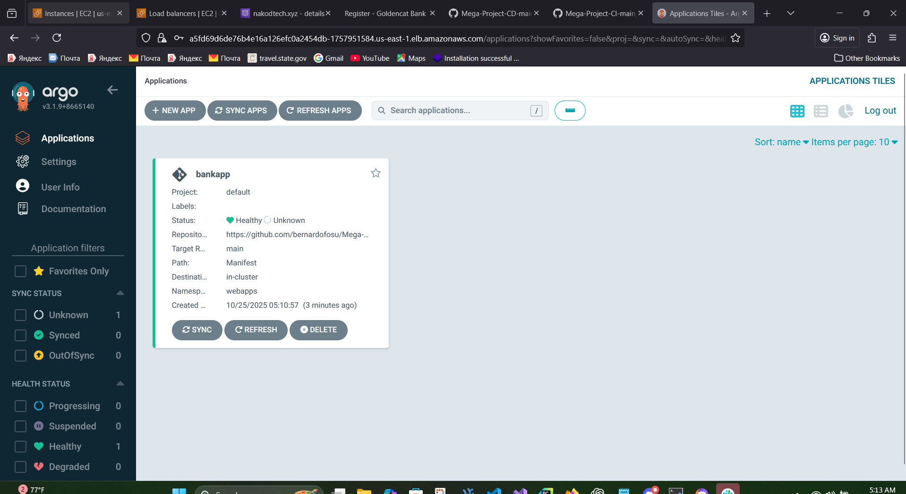

# 🚀 Setting up Argo CD and Integrating k8 and Jenkins for GitOps Deployment

This guide shows how to set up **Argo CD** on your Kubernetes cluster and configure **Jenkins** to deploy via Argo CD — enabling a full **GitOps flow**. 🎯

---

## ⚙️ 1️⃣ Install Argo CD on the Cluster

Run these commands where your `kubectl` points to your EKS cluster (namespace `webapps`).

### 🧩 Create namespace and install Argo CD components

```bash
kubectl create namespace argocd
kubectl apply -n argocd -f https://raw.githubusercontent.com/argoproj/argo-cd/stable/manifests/install.yaml
```

### ⏳ Wait for Argo CD pods to become ready

```bash
kubectl -n argocd rollout status deploy/argocd-server
kubectl -n argocd get pods
```

### 🔑 Get the initial admin password

```bash
kubectl -n argocd get secret argocd-initial-admin-secret -o jsonpath="{.data.password}" | base64 -d ; echo
```

### 🌐 Expose Argo CD API server (EKS)

For testing (EKS), use a LoadBalancer service:

```bash
kubectl -n argocd patch svc argocd-server -p '{"spec":{"type":"LoadBalancer"}}'
kubectl -n argocd get svc argocd-server
```

Wait for the `EXTERNAL-IP`, then access Argo CD UI at:

```
https://<EXTERNAL-IP>
```

(For production, use an Ingress/ALB with TLS.)

---

## 🧱 2️⃣ Create an Argo CD Application Manifest

This manifest tells Argo CD where your repo is, which path to watch, and where to deploy in your cluster.

Save as `argocd/app-bankapp.yaml`:

```yaml
apiVersion: argoproj.io/v1alpha1
kind: Application
metadata:
  name: bankapp
  namespace: argocd
spec:
  project: default
  source:
    repoURL: "https://github.com/bernardofosu/Mega-Project-CD-main.git"
    targetRevision: main
    path: Manifest
  destination:
    server: "https://kubernetes.default.svc"
    namespace: webapps
  syncPolicy:
    automated:
      prune: true # 🗑️ delete resources no longer in Git
      selfHeal: true # 💊 auto-correct drift
    syncOptions:
      - CreateNamespace=true
```



### 🧩 Apply it once ArgoCD is running

```bash
kubectl apply -f argocd/app-bankapp.yaml
```

Then open the Argo CD UI — the app should appear and start syncing automatically.

---

## 🧠 You’re Using a GitOps Workflow!

Your Argo CD manifest:

```yaml
syncPolicy:
  automated:
    prune: true
    selfHeal: true
  syncOptions:
    - CreateNamespace=true
```

means:

> “Continuously watch the `main` branch of my repo, and automatically apply whatever’s inside `/Manifest` to my `webapps` namespace.”

---

## 🔄 How It Works

1. 🧩 Argo CD controller runs in `argocd` namespace.
2. 👀 It watches your Git repo (`main` branch).
3. ⏱️ Every ~3 minutes (or when you click **Refresh**), Argo CD:

   - Pulls the latest commit.
   - Compares it to your current cluster state.

4. ⚡ If differences exist:

   - It syncs automatically (`automated` enabled).
   - Applies new manifests → updates running app.

5. 🗑️ If you remove something from Git, Argo CD prunes it.
6. 🧬 If you manually change something in the cluster, Argo CD heals it.

---

## 🔁 Auto-Deploy on Git Changes

✅ Any commit to `main` → Argo CD automatically:

- Pulls the new manifest
- Applies it to the cluster
- Prunes and heals drift

No Jenkins or manual `kubectl` needed — Git becomes your **single source of truth**. 🧠

---

## 🧩 Typical GitOps Flow

| Step                           | 🧰 Tool             | 📝 Description                             |
| ------------------------------ | ------------------- | ------------------------------------------ |
| 🏗️ Build container image       | Jenkins             | Builds & pushes new image to DockerHub/ECR |
| 🔖 Update manifest (image tag) | Jenkins or manually | Updates `/Manifest/deployment.yaml`        |
| 📦 Commit & push to GitHub     | Git                 | Argo CD detects new commit                 |
| 🚀 Deploy automatically        | Argo CD             | Syncs manifests to cluster                 |

---

## 💡 Instant Sync via GitHub Webhook

By default, Argo CD checks Git every 3 minutes. ⏱️
To sync instantly:

1. Go to **GitHub → Settings → Webhooks → Add webhook**
2. Set URL to:

   ```
   https://<ARGOCD_SERVER>/api/webhook
   ```

3. Content type: `application/json`
4. Trigger: “Push events”
5. Secret: (optional)

Now every push triggers an immediate sync! 🚀

---

## ✅ Summary Table

| 🧩 Feature                    | 🔧 Enabled by             |
| ----------------------------- | ------------------------- |
| Auto-deploy new changes       | ✅ `syncPolicy.automated` |
| Auto-delete removed resources | ✅ `prune: true`          |
| Auto-heal manual drift        | ✅ `selfHeal: true`       |
| Auto-create namespaces        | ✅ `CreateNamespace=true` |
| Continuous Git monitoring     | ✅ Built-in               |
| Instant webhook sync          | ⚙️ Optional               |

---

## 🧠 TL;DR

✨ Because of your `syncPolicy.automated` setup:

> Any change pushed to GitHub’s `main` branch under `/Manifest` is automatically deployed to your cluster — without Jenkins or kubectl commands.

---

### 🌈 Result:

- **Git = Source of truth** 🧾
- **Argo CD = Continuous deployment** ⚙️
- **Jenkins = Image builder / tag updater** 🧱

---

🎉 **Congratulations — you’ve implemented full GitOps with Argo CD + Jenkins!** 🚀
