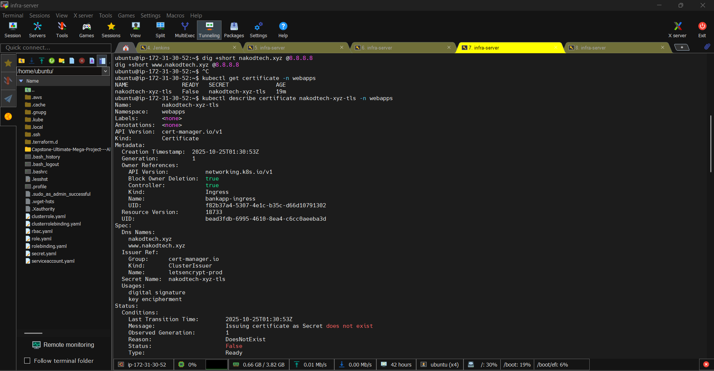
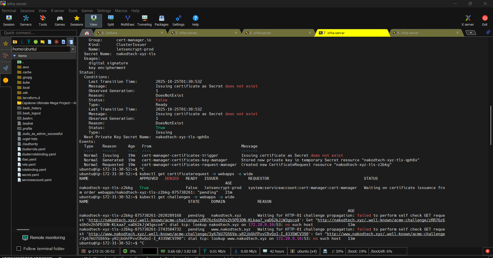

# 🧠 Notes: Ingress & SSL Certificate Issue Fix (nakodtech.xyz)

## ⚠️ Problem Summary

During the deployment of the **GoldenCat Bank App** (`bankapp`) on EKS with NGINX Ingress and Let’s Encrypt SSL, the HTTPS certificate failed to issue.  
The app and Ingress were created successfully, but the certificate remained in a `False` state.

---

## 🧩 Error Symptoms

### 🧾 1. Certificate not ready

```bash
kubectl get certificate -n webapps
NAME                READY   SECRET              AGE
nakodtech-xyz-tls   False   nakodtech-xyz-tls   33m
```

### 🧾 2. Challenge could not resolve domain

```bash
kubectl get challenges -n webapps -o wide
NAME                                           STATE     DOMAIN              REASON
nakodtech-xyz-tls-z2bkg-875738261-2020289168   pending   nakodtech.xyz       Waiting for HTTP-01 challenge propagation: failed to perform self check GET request 'http://nakodtech.xyz/.well-known/acme-challenge/...': dial tcp: lookup nakodtech.xyz on 172.20.0.10:53: no such host
```

### 🧾 3. Certificate request stuck

```bash
kubectl get certificaterequest -n webapps
NAME                      APPROVED   DENIED   READY   ISSUER             STATUS
nakodtech-xyz-tls-z2bkg   True                False   letsencrypt-prod   Referenced "ClusterIssuer" not found: clusterissuer.cert-manager.io "letsencrypt-prod" not found
```

---

## ❌ Root Causes

### 🧱 1. Ingress had no namespace

The initial `Ingress` manifest didn’t specify `namespace: webapps`,  
so it was created in the `default` namespace while the `bankapp-service` lived in `webapps`.

❌ **Incorrect YAML**

```yaml
apiVersion: networking.k8s.io/v1
kind: Ingress
metadata:
  name: bankapp-ingress
  # namespace missing here ❌
  annotations:
    cert-manager.io/cluster-issuer: letsencrypt-prod
```

✅ **Fixed YAML**

```yaml
apiVersion: networking.k8s.io/v1
kind: Ingress
metadata:
  name: bankapp-ingress
  namespace: webapps # ✅ Added namespace
  annotations:
    cert-manager.io/cluster-issuer: letsencrypt-prod
```

---

### 🌐 2. DNS records missing in Route 53

Let’s Encrypt couldn’t reach `nakodtech.xyz` or `www.nakodtech.xyz` because the DNS was not pointing to the ELB created by the Ingress controller.

✅ **Fixed by creating DNS records:**

- Type: **A (Alias)** → points to  
  `ad95be489983e46039f091c85f77e9e5-1034547914.us-east-1.elb.amazonaws.com`
- Type: **CNAME** → `www.nakodtech.xyz` → `nakodtech.xyz`

🧠 Note: Always use **Alias** (not IP) for ELBs in Route53.

---

### 🪄 3. ClusterIssuer not yet applied

Cert-manager couldn’t find the referenced ClusterIssuer.

✅ **Applied this configuration:**

```bash
kubectl apply -f - <<'EOF'
apiVersion: cert-manager.io/v1
kind: ClusterIssuer
metadata:
  name: letsencrypt-prod
spec:
  acme:
    server: https://acme-v02.api.letsencrypt.org/directory
    email: nakodtech@gmail.com
    privateKeySecretRef:
      name: letsencrypt-prod
    solvers:
      - http01:
          ingress:
            class: nginx
EOF
```

---

## 🕓 Waiting for DNS propagation ⏳

Even after fixing everything, the certificate didn’t become `READY=True` immediately.  
It took **about 5–10 minutes** for the DNS records to propagate globally and for Let’s Encrypt to complete validation.

💡 Tip: You can check DNS propagation manually:

```bash
dig +short nakodtech.xyz @8.8.8.8
dig +short www.nakodtech.xyz @8.8.8.8
```

---

## ✅ Final Verification

After a short wait, everything was successful 🎉

### Certificate

```bash
kubectl get certificate -n webapps
NAME                READY   SECRET              AGE
nakodtech-xyz-tls   True    nakodtech-xyz-tls   48m
```

### Secret

```bash
kubectl describe secret nakodtech-xyz-tls -n webapps
Type:  kubernetes.io/tls
Data:
  tls.crt:  3606 bytes
  tls.key:  1675 bytes
```

### Ingress

```bash
kubectl get ingress -n webapps
NAME              CLASS   HOSTS                             ADDRESS                                                                   PORTS     AGE
bankapp-ingress   nginx   nakodtech.xyz,www.nakodtech.xyz   ad95be489983e46039f091c85f77e9e5-1034547914.us-east-1.elb.amazonaws.com   80, 443   48m
```

---

## 🌟 Result

✅ Website accessible via **HTTPS**  
🔐 Valid Let’s Encrypt certificate  
🌍 DNS fully propagated  
🚀 Application accessible at:  
👉 [https://nakodtech.xyz/login](https://nakodtech.xyz/login)

---

## 🧾 Quick Checklist for Future Deployments

1. Add `namespace` in your Ingress YAML.
2. Apply `ClusterIssuer` before Ingress creation.
3. Create DNS records (Alias + CNAME) in Route53.
4. Verify DNS resolves publicly using `dig`.
5. Wait 5–10 minutes for DNS + certificate propagation.
6. Confirm:
   ```bash
   kubectl get ingress -n webapps
   kubectl get certificate -n webapps
   kubectl get secret nakodtech-xyz-tls -n webapps
   ```
   
   
