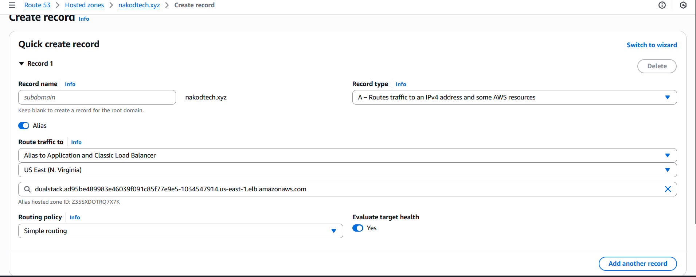
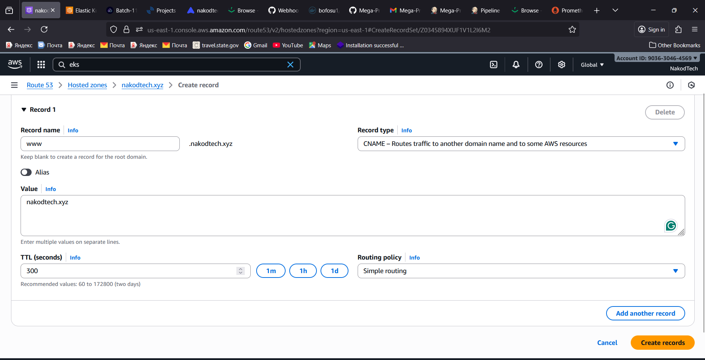
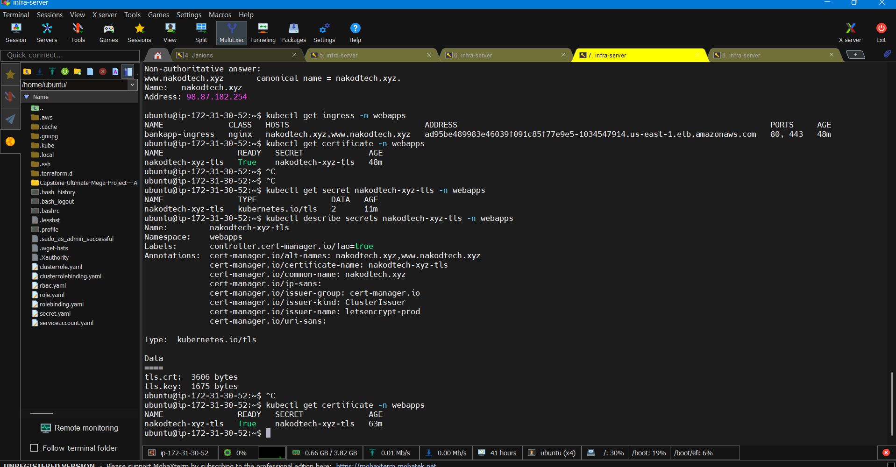

# 🌍 Route 53 Setup for Ingress ELB + Let's Encrypt SSL

This guide explains how to correctly configure **AWS Route 53** DNS records for your **NGINX Ingress Load Balancer** (ELB) to enable **Let's Encrypt HTTPS certificates** using `cert-manager`. 🛠️

---

## ⚙️ Step 1: Identify Your Ingress ELB

Run the following command to get your external ELB DNS name:

```bash
kubectl get svc -n ingress-nginx
```

Example output:

```
ingress-nginx-controller   LoadBalancer   172.20.152.119   ad95be489983e46039f091c85f77e9e5-1034547914.us-east-1.elb.amazonaws.com   80:31927/TCP,443:32648/TCP
```

✅ **ELB DNS Name:** `ad95be489983e46039f091c85f77e9e5-1034547914.us-east-1.elb.amazonaws.com`

This is the address your domain should point to.

---

## 🧾 Step 2: Create DNS Records in Route 53

### 🅰️ A Record for Root Domain (`nakodtech.xyz`)

1. Go to **Route 53 → Hosted Zones → nakodtech.xyz**
2. Click **"Create record"**
3. Leave **Record name** blank → this represents your root domain `nakodtech.xyz`
4. Set **Record type:** `A – Routes traffic to an IPv4 address and some AWS resources`
5. **Turn ON Alias** ✅
6. In **Alias target**, click the text box and select your ELB from the dropdown.

   - 💡 _Don’t paste the ELB name manually — select it from AWS’ list!_

7. **Routing policy:** Simple
8. **TTL:** 300 (default is fine)
9. Click **Create record**
   
   ✅ This correctly links your domain to the Ingress ELB.

---

### 🌐 CNAME Record for `www`

1. Click **"Create record"** again.
2. **Record name:** `www`
3. **Record type:** `CNAME`
4. **Value:** `nakodtech.xyz`
5. **TTL:** 300
6. Click **Create record** ✅
   

---

## 🔎 Step 3: Verify DNS Resolution

Wait 2–5 minutes, then verify your records:

```bash
dig +short nakodtech.xyz @8.8.8.8
dig +short www.nakodtech.xyz @8.8.8.8
```

Expected result:

```
ad95be489983e46039f091c85f77e9e5-1034547914.us-east-1.elb.amazonaws.com.
```

🎉 This confirms DNS is properly set up!

---

## 🔐 Step 4: Check Certificate Status

Once DNS resolves, cert-manager will automatically retry Let's Encrypt validation.

Check certificate status:

```bash
kubectl get certificate -n webapps
kubectl describe certificate nakodtech-xyz-tls -n webapps
```

✅ When you see `READY=True`, your certificate is active!

Access your app securely at:

```
https://nakodtech.xyz
```

---

## 🧠 Troubleshooting Tips

- ❌ **Error:** `Value is not a valid IPv4 address` → You pasted the ELB name manually while Alias was OFF.

  - ✅ **Fix:** Turn ON the Alias toggle and select the ELB from the dropdown.

- ⚡ **DNS not resolving?** Wait a few minutes or flush local DNS cache.
- 🧱 **Cloudflare users:** Disable proxy (grey cloud) until cert is issued.

---

## 🎯 Summary

✅ **Alias A Record** → Root domain → ELB (via AWS Alias target)
✅ **CNAME Record** → www → Root domain
✅ **Cert-manager** issues SSL → HTTPS live

💪 Done! Your domain now routes cleanly to your Kubernetes Ingress with a valid Let's Encrypt certificate. 🚀

### Note its will take time to come up



Ready = False does not always means there is error, sometimes its take time to comeup

